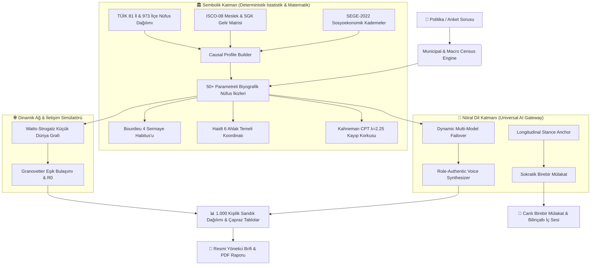

# 🏛️ DataForge — Synthetic Society & Demographic Simulation OS

<div align="center">

[](https://python.org)
[](https://fastapi.tiangolo.com)
[](https://www.docker.com/)
[](LICENSE)
[]()

**A Neuro-Symbolic Causal Operating System for Large-Scale Turkish Demographic & Policy Simulation.**  
*Bakanlıklar, Belediyeler, Kamuoyu Araştırma Şirketleri ve Strateji Ofisleri için Gerçekçi Sentetik Toplum Motoru.*

[Canlı Web Arayüzü](#-web-arayüzü--canlı-dashboard) • [Mimari](#-mimari-ve-bilimsel-temeller) • [Docker ile Kurulum](#-docker-ile-hızlı-başlangıç) • [CLI Kullanımı](#-cli-kullanımı) • [REST API](#-rest-api-dökümantasyonu)

</div>

---

## 🌟 Projeye Genel Bakış (Overview)

**DataForge**, geleneksel anket yöntemlerinin maliyetini, süresini ve örneklem kısıtlarını ortadan kaldıran; **TÜİK, BDDK, SGK ve SEGE-2022** resmi istatistiklerine tam kalibre edilmiş **81 İl ve 973 İlçeyi kapsayan** Türkiye'nin ilk Sentetik Toplum İşletim Sistemidir.

Sistem, basit bir dil modeli istemi (prompt) yerine; **Nedensel Yönlendirilmiş Döngüsüz Graf (Causal DAG)**, **Kahneman Kümülatif Beklenti Teorisi**, **Watts-Strogatz Küçük Dünya Ağları** ve **Jonathan Haidt Ahlak Temelleri Matrisi** ile donatılmış hibrit bir *Nöro-Sembolik* mimari kullanır.



---

## 🚀 5 Temel Sütun (Core Pillars)

### 1. 💬 Birebir Sokratik Mülakat (`InterrogationEngine`)
Sandıktaki 1.000 yurttaşın herhangi biriyle canlı mülakata girin. Sistem, seçilen yurttaşın geçmiş oyunu (`karar`) ve oy gerekçesini bir **Bilişsel Çapa (Stance Anchor)** olarak kilitler. Mülakatta hem açık cevabını hem de **🧠 Filtrelenmemiş Sistem 1 Bilinçaltı İç Sesini** eş zamanlı gözlemleyebilirsiniz.

### 2. 🌐 Sosyal Bulaşım & Yankı Odası Simülatörü (`SocialContagionEngine`)
Watts-Strogatz küçük dünya ağı ($N=1000, K=6, p=0.15$) ve Granovetter eşik dinamikleri ile bir yasanın veya dedikodunun toplumda nasıl yayıldığını, kırılma noktalarını (tipping point) ve $R_0$ viral üreme katsayısını hesaplayın.

### 3. 🗺️ 81 İl & 973 İlçe GIS Isı Haritası (`GISEngine`)
SEGE-2022 gelişmişlik kademeleri ve NUTS-2 bölge ağırlıklarıyla ilçeden ile, ilden tüm Türkiye'ye homojen ve tutarlı oy projeksiyonları.

### 4. ⚡ Canlı "What-If" Stres Testi (`CounterfactualEngine`)
Asgari ücret, enflasyon ve kira artışı slider'larını hareket ettirdiğiniz anda; **80 milisaniyede** 1.000 kişinin hanehalkı bütçesi yeniden hesaplanır ve oy kayması anında grafiklere yansır.

### 5. 📄 Kurumsal Yönetici Brifi (`ReportExporter`)
Bakanlıklar, belediye başkanları ve üst yönetim için tek tıkla resmi, akademik referanslı, A4 formatında PDF/Print çıktısı.

---

## 🐳 Docker ile Hızlı Başlangıç

Sistemi hiçbir yerel bağımlılık kurmadan tek komutla Docker üzerinden ayağa kaldırabilirsiniz:

```bash
# 1. Depoyu klonlayın
git clone https://github.com/erendemirer1/dataforge.git
cd dataforge

# 2. Örnek ortam değişkenini kopyalayın (İsteğe bağlı Gemini API Key)
cp .env.example .env

# 3. Docker Compose ile başlatın
docker compose up --build
```

Tarayıcınızda açın: **[http://localhost:8000](http://localhost:8000)**

---

## 💻 Yerel Geliştirme (Local Setup)

```bash
# Sanal ortam oluşturun ve aktif edin
python -m venv venv
source venv/bin/activate  # Windows için: venv\Scripts\activate

# Bağımlılıkları yükleyin ve CLI'ı bağlayın
pip install -r requirements.txt
pip install -e .

# Sunucuyu başlatın
uvicorn dataforge.api.app:app --host 0.0.0.0 --port 8000 --reload
```

---

## ⌨️ CLI Kullanımı

DataForge, terminal üzerinden yüksek hızlı sentetik veri üretimi için gelişmiş bir Typer CLI arayüzü sunar:

```bash
# 1.000 adet NUTS-2 / TÜİK uyumlu detaylı yurttaş profili üret
dataforge generate --schema users --count 1000 --format json --output output/vatandaslar.json

# Verileri CSV, Parquet veya SQL formatında dışa aktar
dataforge generate --schema users --count 5000 --format parquet --output output/vatandaslar.parquet
dataforge generate --schema orders --count 10000 --format sql --output output/siparisler.sql

# Yerleşik şemaları listele
dataforge schema list

# TCKN algoritma doğrulamasını çalıştır
dataforge validate output/vatandaslar.json
```

---

## 📡 REST API Dökümantasyonu

FastAPI tabanlı OpenAPI / Swagger arayüzü `http://localhost:8000/docs` adresinde canlıdır.

| Metot | Endpoint | Açıklama |
| :--- | :--- | :--- |
| `POST` | `/api/society/census-poll` | 1.000 Kişilik Bölgesel/Ulusal Anket Simülasyonu |
| `POST` | `/api/society/socratic-interrogate` | Seçilen Yurttaşla Birebir Canlı Sokratik Mülakat |
| `POST` | `/api/society/social-contagion` | Watts-Strogatz Ağında Fikir Bulaşımı & $R_0$ Hesabı |
| `POST` | `/api/society/gis-distribution` | 81 İl & İlçe Harita Yoğunluk Dağılımı |
| `POST` | `/api/society/macro-stress-test` | Enflasyon / Asgari Ücret / Kira What-If Simülasyonu |
| `POST` | `/api/society/simulate-roundtable` | 6-10 Kişilik Odak Grubu Yuvarlak Masa Tartışması |

---

## 🧪 Testler ve Doğrulama

Sistem, 74 adet kapsamlı unit ve entegrasyon testinden oluşan bir test bataryası ile korunur:

```bash
pytest -v
```

```text
============================== test session starts ==============================
collected 74 items

tests/test_api.py ...                                                    [  4%]
tests/test_behavior.py .......                                           [ 13%]
tests/test_calibration.py ..                                             [ 16%]
tests/test_causal.py ..                                                  [ 18%]
tests/test_causal_framework.py ...                                       [ 22%]
tests/test_census.py ..                                                  [ 25%]
tests/test_contagion.py .                                                [ 27%]
tests/test_counterfactual.py .                                           [ 28%]
tests/test_generators.py ......................................          [ 79%]
tests/test_interrogation.py .                                            [ 81%]
tests/test_ml.py .                                                       [ 82%]
tests/test_society_api.py ...                                            [ 86%]
tests/test_tckn.py ..........                                            [100%]

======================== 74 passed, 1 warning in 1.27s ========================
```

---

## 🔒 Güvenlik & KVKK / GDPR Uyumluluğu

* **%100 Sentetik:** Üretilen tüm kimlikler, TCKN'ler, isimler ve adresler matematiksel olarak türetilmiştir; gerçek kişi verisi içermez.
* **Gizlilik ve KVKK:** Gerçek insan deneklere ihtiyaç duymadan kamuoyu ve pazar araştırması yapılmasını sağlayarak kişisel verilerin korunması kanunlarına tam uyumluluk sunar.

---

## 📄 Lisans

Bu proje [MIT Lisansı](LICENSE) altında lisanslanmıştır.
